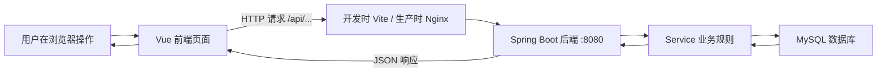
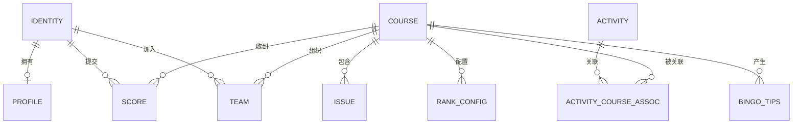
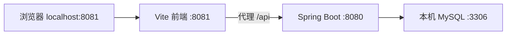
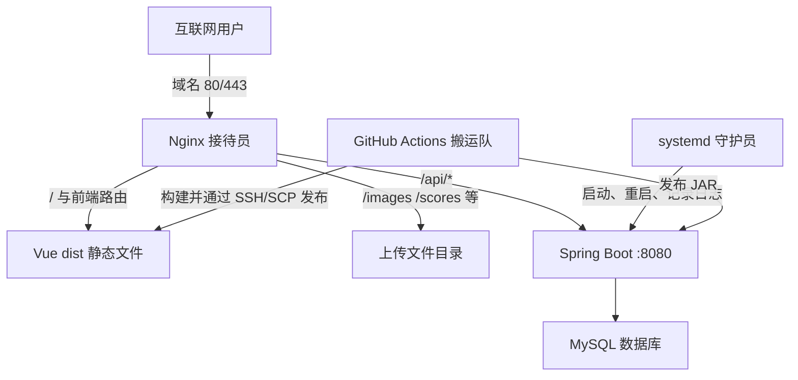

1. 用户在登录页输入账号和密码。
2. 前端把它们装进一个“电子订单”，向 `/api/identity/login` 发出 POST 请求。
3. 后端收到订单，检查格式，再去数据库查账号、核对密码。
4. 数据库返回记录，后端根据业务规则判断登录成功或失败。
5. 后端返回 JSON，前端把 JSON 变成“登录成功”“密码错误”等人能看懂的画面。

一句话总结：

> 前端负责“人与系统怎么交流”，后端负责“事情应该怎么办”，数据库负责“事情要记在哪里”。

## 1.3 为什么要拆成这些部分

可以反问听众：如果餐厅把点菜、做菜、记账全交给一个人，会怎样？答案通常是混乱、难修改、容易出错。网站分层也是为了：

- 页面改颜色时，不必重写数据库。
- 业务规则变化时，不必把所有页面推倒重来。
- 数据库可以统一保存数据，不因浏览器关闭而消失。
- 出错时能判断是“菜单问题”“厨房问题”还是“仓库问题”。

### 现场演示

同时打开三个窗口：浏览器、前端终端、后端终端。停止后端，刷新页面让数据请求失败；再启动后端恢复。让新人亲眼看到“前端还在，但厨房关门了”。

---

# 第二部分：前端、后端、数据库分别是什么

## 2.1 前端是什么

前端是用户能直接看到和操作的部分，包括页面布局、按钮、表单、提示、动画，以及将后端数据展示出来的逻辑。它通常在浏览器中运行。

主流前端选择包括：

- Vue：容易上手、结构清楚，国内项目很多。
- React：生态非常大，应用广泛。
- Angular：规则完整，常见于大型企业项目。
- 原生 HTML、CSS、JavaScript：所有网页的基础。

本项目使用 Vue 3 + TypeScript + Vite：

- Vue 3：把页面拆成可复用组件。
- TypeScript：给 JavaScript 增加类型检查，减少传错数据。
- Vite：开发时快速启动页面，发布时负责构建。
- Element Plus：提供表单、表格、弹窗等现成组件。
- Tailwind CSS 和普通 CSS：控制布局、颜色与样式。

形象说法：Vue 是搭积木的方法，Element Plus 是现成积木，CSS 是积木的外观，Vite 是把积木运到展厅的工具。

## 2.2 后端是什么

后端是运行在服务器上的程序。它接收请求、执行规则、访问数据库并返回结果。用户通常看不到后端本身，只能看到结果。

主流后端选择包括：

- Java + Spring Boot：成熟、规范、适合长期维护和大型系统。
- JavaScript/TypeScript + Node.js（Express、NestJS）：前后端可以使用相近语言。
- Python（Django、FastAPI、Flask）：开发快，AI 和数据领域也常见。
- Go（Gin 等）：性能好、部署简单。
- C# + ASP.NET Core：微软技术生态常用。

本项目使用 Java 17 + Spring Boot + Maven：Spring Boot 提供网站服务框架，Maven 下载依赖、测试和打包，JPA/Hibernate 帮助 Java 对象读写 MySQL。

形象说法：Java 是厨房使用的语言，Spring Boot 是整套厨房设备和工作规范，Maven 是采购与装配工具。

## 2.3 数据库是什么

数据库是专门管理长期数据的软件。普通文件像一叠纸，数据库则像有编号、目录、规则和查询员的档案馆。

主流类型包括：

- 关系型数据库：MySQL、PostgreSQL、SQL Server、Oracle。数据放在相互关联的表中，适合账户、订单、成绩等结构明确的数据。
- 文档数据库：MongoDB。数据更像一份份 JSON 文档。
- 缓存/键值数据库：Redis。速度快，常用于缓存、验证码、会话，不通常作为全部业务数据的唯一存储。
- 嵌入式数据库：SQLite。一个文件就是数据库，适合小工具和移动应用。

本项目使用 MySQL 8，是关系型数据库。浏览器关闭后数据仍在，因为数据不保存在页面里，而在 MySQL 中。

## 2.4 三者的边界

可以用三个问题帮助新人判断代码属于哪里：

- “用户看见什么、点了什么？”通常是前端。
- “能不能做、怎么算、谁有权限？”通常是后端。
- “需要长期保存和查询什么？”通常是数据库。

例如“删除课题”：前端显示删除按钮和确认框；后端判断是不是管理员并执行删除规则；数据库保存删除状态。只隐藏前端按钮并不能阻止别人直接请求后端，所以真正的权限必须写在后端。

---

# 第三部分：前后端如何结合，怎样理解 HTTP

## 3.1 HTTP 是统一格式的“对话规则”

前端和后端可能使用不同语言，但它们都能理解 HTTP。一次 HTTP 对话包含：

- URL：要找哪个窗口，例如 `/api/course/83`。
- Method：想做什么，例如 GET 或 POST。
- Headers：附加说明，例如数据格式、登录身份。
- Body：要提交的具体内容，通常是 JSON 或文件。
- Status：后端处理结果，例如 200、404、500。
- Response Body：后端返回的数据或错误说明。

类比快递：URL 是收件地址，Method 是业务类型，Headers 是快递单备注，Body 是包裹，Status 是签收结果。

## 3.2 HTTP 方法不要死记，要理解意图

| 方法 | 人话 | 餐厅例子 | 项目例子 |
|---|---|---|---|
| GET | 请把某些东西给我看看 | 看菜单 | 查询课题、成绩、用户 |
| POST | 请新增一件事或执行一次动作 | 下新订单 | 注册、登录、上传、提交成绩 |
| PUT | 请把已有内容更新成这样 | 修改整张订单 | 更新课题、审核成绩 |
| PATCH | 请只改其中一小部分 | 只改饮料 | 项目当前较少使用 |
| DELETE | 请删除这个对象 | 取消订单 | 删除课题、用户或提示 |

方法表达的是意图，不代表安全性。POST 不天然安全，GET 也不代表任何人都能看；身份和权限仍由后端判断。

## 3.3 一个请求的实际样子

```http
GET /api/course/83 HTTP/1.1
Host: localhost:8081
```

后端可能返回：

```json
{
  "code": 200,
  "message": "success",
  "data": {
    "id": 83,
    "title": "音游社活动",
    "category": "bingo"
  }
}
```

JSON 可以理解成计算机之间传递的结构化表格：字段名说明含义，字段值保存内容。

## 3.4 前端怎样调用后端

本项目把请求集中放在 `vueproject/src/api`。例如概念上会写：

```ts
import request from '@/utils/request'

export const fetchCourseById = (id: number) => {
  return request.get(`/course/${id}`)
}
```

`src/utils/request.ts` 会自动在地址前加 `/api`，最终变成 `/api/course/83`。开发环境中，Vite 再把它转发到 `http://localhost:8080`。

为什么不在每个页面里随便写请求？因为集中管理后，地址变化、超时、登录信息和错误处理更容易统一修改。

## 3.5 后端怎样接收 HTTP 请求

Spring Boot 用注解把 Java 方法挂到某个地址：

```java
@RestController
@RequestMapping("/api/course")
public class CourseController {

    @GetMapping("/{id}")
    public Result getCourse(@PathVariable Integer id) {
        return courseService.findById(id);
    }
}
```

可以把注解理解成窗口上方的牌子：

- `@RestController`：这里是一个提供 JSON 的服务窗口。
- `@RequestMapping("/api/course")`：这个窗口组的总地址。
- `@GetMapping("/{id}")`：使用 GET 并带一个编号时，由这个方法接待。
- `@PathVariable`：把地址中的 `83` 取出来交给参数 `id`。

Controller 收到请求后通常不亲自完成所有工作，而是交给 Service。这就像前台登记需求，真正的规则交给业务人员处理。

## 3.6 状态码的理解

- 2xx：事情办成了。最常见是 200。
- 4xx：请求一方需要修改。400 参数错，401 未登录，403 无权限，404 找不到。
- 5xx：服务端处理失败。500 是后端异常，502 常见于 Nginx 找不到后端。

现场排错时，让新人打开浏览器 F12 → Network，点开一条 `/api` 请求，依次找 URL、Method、Status、Payload、Response。

### 现场练习

给出三张“订单卡”：查看第 83 号课题、新建一门课题、删除第 83 号课题，让新人选择 GET/POST/DELETE，并说出 URL 中应该包含什么。重点听理由，不只看答案。

---

# 第四部分：本项目前端目录

```text
vueproject/
├─ public/                 原样公开的静态文件，如 favicon
├─ src/
│  ├─ api/                 和后端说话的请求函数
│  ├─ assets/              会参与构建的图片等资源
│  ├─ components/          多个页面可复用的积木
│  ├─ router/              URL 应显示哪个页面
│  ├─ styles/              全局样式和主题
│  ├─ utils/               通用工具；request.ts 统一管理请求
│  ├─ views/               完整页面
│  │  ├─ auth/             登录、注册
│  │  ├─ admin/            管理后台
│  │  ├─ activity/         活动页面
│  │  ├─ profile/          个人资料
│  │  ├─ task/             不同类型的课题详情
│  │  └─ pages/            首页、排名、链接等页面
│  ├─ App.vue              页面应用的外层入口
│  └─ main.ts              启动 Vue 应用
├─ index.html              浏览器最先加载的 HTML 壳
├─ package.json            依赖和 dev/build 命令
├─ pnpm-lock.yaml          锁定依赖准确版本
├─ vite.config.ts          端口、代理和构建设置
└─ tsconfig*.json          TypeScript 检查规则
```

## 4.1 用一本书来记目录

- `main.ts` 是“打开这本书”。
- `App.vue` 是书的外壳。
- `router` 是目录，决定某个网址翻到哪一页。
- `views` 是各个完整章节。
- `components` 是章节中反复使用的图表、页眉和小卡片。
- `api` 是写给后端的信件模板。
- `styles` 是字体、排版和装饰规则。

## 4.2 改需求时怎样找文件

- “登录按钮显示不对”：先找 `views/auth/Login.vue`。
- “多个管理页的分页都有问题”：先找 `components/AdminPagination.vue`。
- “请求地址不对”：先看 `src/api` 和 `src/utils/request.ts`。
- “输入一个 URL 后显示哪个页面”：看 `src/router/index.ts`。
- “整个网站颜色或背景问题”：看 `src/styles` 和全局背景组件。

告诉新人：不要凭文件名修改，先从页面找到 API，再找到后端接口，建立完整调用链。

---

# 第五部分：本项目后端目录

```text
webpage/
├─ pom.xml                              Maven 依赖与构建配置
├─ mvnw / mvnw.cmd                      项目自带的 Maven 启动工具
└─ src/
   ├─ main/
   │  ├─ java/com/cdmga/uestc/webpage/
   │  │  ├─ WebpageApplication.java     后端总开关
   │  │  ├─ Controller/                 HTTP 接待窗口
   │  │  ├─ Service/                    业务规则与流程
   │  │  ├─ Repository/                 数据库查询入口
   │  │  ├─ Entity/                     Java 对象和数据表的对应关系
   │  │  ├─ Dto/                        专门用于传输的数据形状
   │  │  ├─ common/                     公共请求/响应对象
   │  │  └─ Configuration/              安全、跨域、时区等全局设置
   │  └─ resources/
   │     ├─ application.properties      公共配置
   │     ├─ application-dev.properties  开发配置
   │     └─ application-prod.properties 生产配置
   └─ test/                              自动测试
```

## 5.1 用公司办事大厅来记分层

- Controller 是前台：接材料、确认要办什么、把结果交回去。
- Service 是业务科室：判断是否符合规则、完成具体流程。
- Repository 是档案查询员：负责查表和保存记录。
- Entity 是标准档案表：规定每一栏叫什么、是什么类型。
- DTO 是对外申请表：只收这次业务真正需要的字段。
- Configuration 是整栋楼的规章：端口、跨域、安全和时区。

## 5.2 为什么不能把所有代码写进 Controller

如果前台既接待、又审核、又自己进仓库改档案，代码会很快混乱，也难测试。分层让同一业务规则能被复用，让数据库访问集中，也让出错位置更明确。

## 5.3 本项目后端模块如何对应

`CourseController → CourseService → CourseRepository → Course` 是一条完整课题链；Identity、Profile、Score、Activity、Rank、Team 和 BingoTip 也大致使用相同结构。学习时先完整跟踪一条链，不要一次读完所有 Java 文件。

## 5.4 必须向新人说明的安全现实

本项目当前 `SecurityConfig` 对所有路径执行 `permitAll()`，页面里的管理员判断不能真正保护接口。讲解时可以把它作为反例：门口菜单藏起来，不等于厨房门上锁。今后真正的身份和管理员权限必须在后端验证。

---

# 第六部分：本项目数据库结构

## 6.1 表、行、列是什么

把数据库表想成 Excel 工作表：

- 表：一类数据，例如账户表。
- 行：一个具体对象，例如某个用户。
- 列：对象的一项属性，例如账号或角色。
- 主键：每行唯一的内部编号，通常是 `id`。
- 外键：指向另一张表某一行的编号，用于建立关系。

数据库比 Excel 多了严格类型、唯一性、外键、事务、索引和并发控制，不能把它简单等同于 Excel。

## 6.2 主要表及作用

| 表 | 保存什么 | 重要关系 |
|---|---|---|
| `identity` | 账号、密码哈希、角色 | 一个账户可有关联资料和成绩 |
| `profile` | 头像、简介、称号、审核状态 | `identity_id` 指向账户 |
| `course` | 课题标题、类别、时间、图片 | 被题目、成绩、活动等引用 |
| `issue` | 课题内的题目、歌曲、图片、文件 | `course_id` 指向课题 |
| `score` | 用户提交、图片、得分、审核状态 | 连接账户与课题 |
| `activity` | 活动名称、时间、横幅、附件 | 通过关联表连接课题 |
| `activity_course_assoc` | 哪个活动包含哪个课题 | 连接 activity 和 course |
| `rank_config` | 某课题的计分配置 | `course_id` 指向课题 |
| `team` | Bingo 课题中的队伍成员 | 连接课题、队伍编号和用户 |
| `bingo_tips` | 某队伍对某题的提示 | 关联课题、题目和队伍 |

## 6.3 核心关系图



`||` 可以理解为“一个”，`o{` 可以理解为“零个或多个”。例如一个课题可以收到多条成绩，而一条成绩属于一个课题。

## 6.4 用成绩提交理解多表关系

成绩记录不需要复制整份用户名和课题内容，只保存 `identity_id` 和 `course_id`：就像成绩单写学号和课程号，需要展示时再去账户表和课程表查名称。这样改用户名时不需要修改历史上每一条成绩。

## 6.5 SQL 的四个基础动作

```sql
SELECT * FROM course WHERE id = 83;       -- 查
INSERT INTO course (...) VALUES (...);    -- 增
UPDATE course SET title = '新标题' WHERE id = 83; -- 改
DELETE FROM course WHERE id = 83;         -- 删
```

讲解时务必强调：生产库的 UPDATE/DELETE 如果没有正确的 WHERE，可能影响整张表。新人不应直接执行 AI 生成的生产 SQL。

当前项目还普遍使用 `is_deleted` 做逻辑删除：不是立即擦掉数据，而是盖一个“已删除”章，并在查询中隐藏。这有利于审计和恢复，但所有查询必须正确过滤。

### 数据库讲解注意事项

不要现场导入仓库中的完整 `CDMGA.sql`。它包含实际记录和 `DROP TABLE`，应使用脱敏演示库。生产配置当前还存在明文数据库凭据，应先轮换并迁移到环境变量。

---

# 第七部分：本地部署与服务器部署

## 7.1 什么是本地运行/本地部署

本地运行是前端、后端、数据库都运行在开发者自己的电脑上：



`localhost` 就是“这台电脑自己”。其他互联网用户通常访问不到。它适合开发和试错，因为不会直接影响正式网站。

本项目本地运行需要：

1. MySQL 启动并准备本地测试库。
2. 在 `webpage` 运行 Maven/Spring Boot。
3. 在 `vueproject` 运行 `pnpm dev`。
4. 浏览器访问 `http://localhost:8081`。

先跑通网络的含义是：浏览器能打开前端，前端 `/api` 请求能到后端，后端能连接数据库，响应能沿原路返回。

## 7.2 什么是服务器部署

服务器部署是把程序放到一台有公网/校园网地址、长时间开机的计算机上，让多人访问。开发工具不适合作为正式服务，所以要把源代码变成更稳定的发布产物：

- 前端执行 `pnpm build`，得到 `dist` 静态文件。
- 后端执行 `mvn clean package -P prod`，得到可运行 JAR。
- 数据库运行在受保护的 MySQL 服务中。

## 7.3 本项目服务器上的角色



形象解释：

- Nginx 是总接待台。要网页就从文件柜取；要图片就去上传目录；以 `/api` 开头就转给后端厨房。
- systemd 是值班经理。服务器开机时启动后端，后端意外退出时重启，并把运行情况记到日志。
- GitHub Actions 是自动搬运队。代码合并后，在干净机器上安装依赖、构建，再用 SSH/SCP 把产物送到服务器。
- SSH 像经过加密且需要钥匙的远程员工通道；SCP 是在这条安全通道中搬文件。
- Nginx 反向代理像前台代办：用户只认识一个域名，不必知道后端实际在 8080。

## 7.4 从本地成功到上线的完整流程

1. 在功能分支开发，连接本地测试数据库。
2. 前端运行 `pnpm build`，后端运行测试和生产打包。
3. 浏览器手测成功、失败、空数据和权限场景。
4. 推送分支并创建 Pull Request，由维护者审查。
5. 合并到 `main` 后触发 `.github/workflows/CD.yml`。
6. Actions 更新环境配置，构建后端 JAR 和前端 dist。
7. 通过 SSH/SCP 上传服务器；旧版本先备份。
8. 前端通过软链接切换到新版本；后端由 systemd 重启。
9. Nginx 继续通过同一域名提供前端、文件和 API。
10. 发布者检查 Actions、服务日志、关键页面；失败则回滚。

## 7.5 为什么本地能跑，服务器仍可能失败

- 本地是 Windows，服务器是 Linux，文件路径和大小写不同。
- 本地写 `localhost` 指自己电脑，服务器中的 `localhost` 指服务器自己。
- 服务器有文件权限、防火墙、安全组、域名、HTTPS 等额外环节。
- 本地开发使用 Vite 代理，生产使用 Nginx 代理。
- 服务器上传目录必须存在，且 `webserver` 用户有写权限。
- 数据库网络和账号权限可能不同。

所以“在我电脑上没问题”只是第一关，不是上线证明。

## 7.6 当前部署方案要特别说明的点

- `main` 推送会部署生产后端和 main 前端，不能直接在 main 试验。
- `dev` 当前只部署 dev 前端，两套前端共用后端 8080。
- Nginx 当前配置监听 80，正式生产应补 HTTPS。
- `init.yml` 最后仍引用旧的 npm 工作流，而现行前端使用 pnpm，首次初始化前需要修正。
- Nginx 上传限制 5 MB，Spring Boot 是 10 MB，应统一。
- 数据库迁移、认证授权、备份恢复是上线前必须继续补齐的能力。

---

# 收尾：让新人复述，而不是继续听讲

请每位新人用自己的话回答：

1. 点击登录后，请求依次经过哪些部分？
2. 页面按钮被隐藏，为什么仍不代表接口安全？
3. GET、POST、PUT、DELETE 各自表达什么意图？
4. 修改登录页面、登录请求、登录规则、账户字段分别先去哪一层找？
5. `localhost:8081` 和 `localhost:8080` 分别是谁？
6. Nginx、systemd、GitHub Actions 各自像什么，负责什么？
7. 为什么不能把生产密码或完整数据库发给 AI？

能清楚回答这些问题，就达到了本次培训目标。

## 推荐的现场操作顺序

1. 5 分钟：展示网站与登录流程，提出主线问题。
2. 15 分钟：餐厅类比和整体链路。
3. 15 分钟：前端、后端、数据库及主流技术。
4. 20 分钟：F12 Network 观察一次真实 HTTP 请求。
5. 15 分钟：沿 `course` 功能查看前端 API → Controller → Service → Repository → Entity。
6. 10 分钟：用数据库工具只读查看 course 与 score 的关系。
7. 15 分钟：本地结构与服务器结构、部署接力。
8. 10 分钟：新人复述、判断题和答疑。

## 五道判断题

1. “前端隐藏了管理员按钮，所以普通用户无法调用管理员接口。”——错，后端还必须鉴权。
2. “数据库就是保存到服务器上的一个 Excel。”——不准确，只能作为最初类比。
3. “GET 通常用于读取，DELETE 表达删除意图。”——对。
4. “本地前端能打开，就说明后端和数据库都正常。”——错。
5. “AI 给的命令只要看起来专业，就可以在生产服务器复制执行。”——错。

