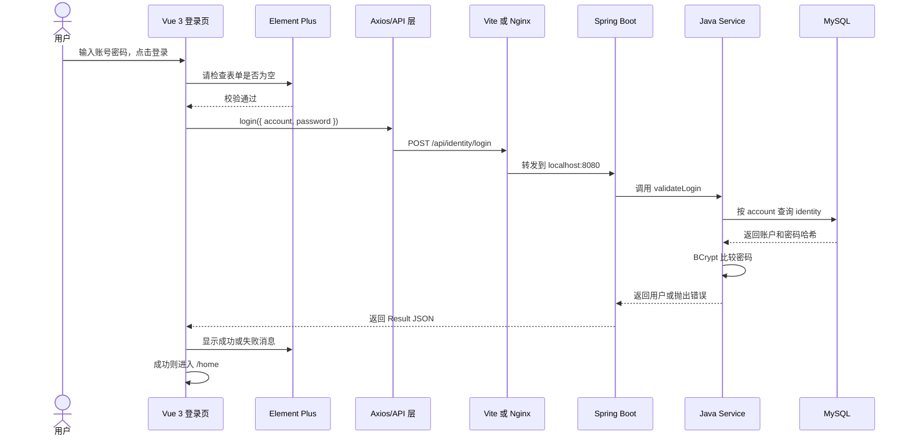

# 登录功能实例：七项技术怎样共同完成一次登录

> 本文只讲仓库中当前真实存在的代码。建议授课时先演示一次登录，再按本文顺序逐个打开文件。

## 先看完整链路

用户输入账号密码后，代码并不是由一种技术独自完成登录，而是像接力赛一样逐步传递：



一句话版本：

> Vue 收集操作，Element Plus 提供表单零件，CSS 负责外观，Spring Boot 接收 HTTP，Java 执行业务，Maven准备后端工具，Nginx 在生产服务器上把请求送到后端。

---

# 1. Vue 3：让登录页面“活起来”

## 它在登录中的作用

Vue 3 负责：

- 组织登录页面的结构。
- 保存用户当前输入的账号和密码。
- 响应点击登录、点击重置、按回车等操作。
- 调用登录 API。
- 根据返回结果保存登录信息并跳转页面。

可以把 Vue 理解成登录页面的“现场导演”：它不负责验证数据库密码，但决定演员什么时候出场、按钮什么时候响应、结果显示在哪里。

## 对应代码

主要文件：[Login.vue](../vueproject/src/views/auth/Login.vue)。

### 保存输入内容

```ts
const ruleForm = reactive({
  account: '',
  password: '',
})
```

`reactive` 是 Vue 3 的响应式能力。用户在输入框打字时，`ruleForm.account` 和 `ruleForm.password` 会同步变化。

模板中用 `v-model` 建立双向连接：

```vue
<el-input v-model="ruleForm.account" />
<el-input v-model="ruleForm.password" type="password" />
```

形象理解：`v-model` 像一根双向传送带。输入框变了，数据跟着变；代码修改数据，输入框也会跟着变。

### 响应登录按钮

```vue
<NeonActionButton :loading="loading" @click="submitForm">
  登录
</NeonActionButton>
```

`@click="submitForm"` 表示用户点击时调用 `submitForm`。按钮提交期间，`loading` 会变为 `true`，避免用户误以为没有响应。

### 调用后端并处理结果

```ts
const response = await login({
  account: ruleForm.account,
  password: ruleForm.password,
})
```

登录成功后：

```ts
sessionStorage.setItem('userInfo', JSON.stringify(response.data.data))
sessionStorage.setItem('role', JSON.stringify(response.data.data.role))
router.push('/home')
```

Vue 将用户信息暂存到浏览器的 `sessionStorage`，然后通过 Vue Router 跳转到 `/home`。

路由定义和未登录拦截位于 [router/index.ts](../vueproject/src/router/index.ts)：`/login` 显示 `Login.vue`，其他页面会检查 `sessionStorage` 中是否存在 `userInfo`。

## 讲解重点

Vue 只知道“把账号密码发出去”和“根据结果更新页面”。真正的密码校验不应该写在 Vue 中，因为用户可以查看和修改浏览器里的前端代码。

---

# 2. Element Plus：提供成熟的表单零件

## 它在登录中的作用

Element Plus 是 Vue 的 UI 组件库。本项目用它完成：

- 登录表单 `el-form`。
- 用户名和密码字段 `el-form-item`。
- 输入框 `el-input`。
- 必填校验及错误文字。
- 密码显示/隐藏按钮。
- 登录成功、警告和错误消息 `ElMessage`。

形象理解：Vue 告诉页面“这里需要一个输入框”，Element Plus 提供已经做好的、支持校验和交互的输入框，不需要开发者从木板开始制作。

## 对应代码

[Login.vue](../vueproject/src/views/auth/Login.vue) 模板：

```vue
<el-form :model="ruleForm" :rules="rules">
  <el-form-item label="用户名" prop="account">
    <el-input v-model="ruleForm.account" placeholder="请输入用户名" />
  </el-form-item>
  <el-form-item label="密码" prop="password">
    <el-input v-model="ruleForm.password" type="password" show-password />
  </el-form-item>
</el-form>
```

校验规则：

```ts
const rules = reactive({
  account: [{ required: true, message: '用户名不能为空！', trigger: 'blur' }],
  password: [{ required: true, message: '密码不能为空！', trigger: 'blur' }],
})
```

消息提示：

```ts
ElMessage.success('登录成功')
ElMessage.warning('登录失败')
ElMessage.error(errorMessage)
```

Element Plus 由 [vite.config.ts](../vueproject/vite.config.ts) 中的 `ElementPlusResolver` 自动导入组件样式；`ElMessage` 则在 `Login.vue` 中显式导入。

## 讲解重点

Element Plus 的必填检查只负责改善体验。攻击者可以绕过页面直接发送请求，所以后端仍须再次校验账号、密码、权限等内容。

---

# 3. CSS：决定登录页长什么样

## 它在登录中的作用

CSS 只负责表现，不负责数据库校验。当前登录页混合使用两种样式方式：

1. 模板中的 Tailwind CSS 工具类负责布局、间距、颜色和响应式效果。
2. `<style scoped>` 中的普通 CSS 深度定制 Element Plus 输入框。

形象理解：Vue 和 Element Plus 搭起房屋结构，CSS 负责墙面颜色、灯光、间距和在手机屏幕上如何重新摆放家具。

## 对应代码

[Login.vue](../vueproject/src/views/auth/Login.vue) 顶部大量 `class`：

```vue
<div class="min-h-[calc(100vh-60px)] flex items-center justify-center ...">
```

- `flex`：使用弹性布局。
- `items-center justify-center`：让内容水平、垂直居中。
- `max-[820px]:...`：屏幕较窄时应用另一套布局。
- `text-[#e5f4ff]`、`bg-[...]`：文字颜色与渐变背景。

同一文件底部的普通 CSS：

```css
.auth-form :deep(.el-input__wrapper) {
  background: rgba(10, 35, 66, 0.75);
  box-shadow: inset 0 0 0 1px rgba(112, 196, 242, 0.24);
  transition: box-shadow 0.2s ease, background-color 0.2s ease;
}
```

`:deep(...)` 是因为 Element Plus 输入框内部由组件生成；Vue 的 `scoped` 样式默认不能直接进入组件内部，所以需要显式“深入”修改。

全局样式入口在 [main.ts](../vueproject/src/main.ts) 中导入 `src/styles/index.css`。Tailwind 插件在 [vite.config.ts](../vueproject/vite.config.ts) 中注册。

## 讲解重点

删掉这些 CSS，登录功能理论上仍能提交，但页面会变得朴素或布局错乱；只修改 CSS，不应该改变密码校验规则。

---

# 4. Java：编写实际的登录业务逻辑

## 它在登录中的作用

Java 是后端源代码使用的编程语言。登录流程中，Java 类负责：

- 表示收到的账号密码。
- 查询账户。
- 使用 BCrypt 比较明文密码与数据库中的密码哈希。
- 用户不存在或密码错误时抛出异常。
- 构造返回给前端的结果对象。

形象理解：Spring Boot 建好了办事大厅，Java 是工作人员实际执行的办事规则。

## 对应代码

### 请求的数据形状

[LoginRequest.java](../webpage/src/main/java/com/cdmga/uestc/webpage/common/LoginRequest.java)：

```java
public class LoginRequest {
    private String account;
    private String password;
}
```

它对应前端发送的 JSON：

```json
{
  "account": "用户名",
  "password": "用户输入的密码"
}
```

### 密码校验规则

[IdentityService.java](../webpage/src/main/java/com/cdmga/uestc/webpage/Service/IdentityService.java)：

```java
public Identity validateLogin(String account, String password) {
    Identity identity = identityRepository.findByAccount(account);
    if (identity == null) {
        throw new RuntimeException("用户不存在");
    }
    if (!passwordEncoder.matches(password, identity.getPassword())) {
        throw new RuntimeException("密码错误");
    }
    return identity;
}
```

这里不是把两个明文密码直接比较。注册时数据库保存 BCrypt 哈希；登录时 `matches` 检查本次输入能否对应这个哈希。

### 查询账户

[IdentityRepository.java](../webpage/src/main/java/com/cdmga/uestc/webpage/Repository/IdentityRepository.java)：

```java
Identity findByAccount(String account);
```

Spring Data JPA 会根据方法名生成按 `account` 查询 `identity` 表的逻辑。

## 讲解重点

Java 是语言，不是服务器框架。Java 代码可以做很多事情；本项目选择用 Spring Boot 组织 Java 后端。

---

# 5. Spring Boot：把 Java 登录代码变成 HTTP 接口

## 它在登录中的作用

Spring Boot 负责：

- 启动 8080 端口上的 Web 服务。
- 把 `POST /api/identity/login` 交给对应 Java 方法。
- 把请求 JSON 转成 `LoginRequest` 对象。
- 管理 Controller、Service、Repository 对象及其依赖。
- 通过 JPA 连接数据库。
- 把 `Result` 对象序列化为 JSON 返回前端。

形象理解：Java 工作人员知道怎么验证账户；Spring Boot 负责建窗口、贴地址牌、接收材料并把结果送回去。

## 对应代码

[IdentityController.java](../webpage/src/main/java/com/cdmga/uestc/webpage/Controller/IdentityController.java)：

```java
@RestController
@RequestMapping("/api/identity")
public class IdentityController {

    @PostMapping("/login")
    public Result login(@RequestBody LoginRequest loginRequest) {
        try {
            Identity user = identityService.validateLogin(
                loginRequest.getAccount(),
                loginRequest.getPassword()
            );
            return Result.success(user);
        } catch (Exception e) {
            return Result.error(e.getMessage());
        }
    }
}
```

把注解翻译成人话：

- `@RestController`：这个类提供 HTTP/JSON 接口。
- `@RequestMapping("/api/identity")`：所有窗口地址先以此开头。
- `@PostMapping("/login")`：POST 到 `/api/identity/login` 时运行这个方法。
- `@RequestBody`：把请求正文 JSON 装入 `LoginRequest`。
- `identityService.validateLogin(...)`：把真正的校验交给业务层。

[Result.java](../webpage/src/main/java/com/cdmga/uestc/webpage/common/Result.java) 规定统一返回结构：

```json
{
  "code": 0,
  "message": "操作成功",
  "data": {}
}
```

数据库对象 [Identity.java](../webpage/src/main/java/com/cdmga/uestc/webpage/Entity/Identity.java) 使用 `@Entity` 和 `@Table(name = "identity")` 映射 MySQL 的 `identity` 表。

## 讲解重点

Spring Boot 不负责决定“密码对不对”这一业务结论；它主要负责让 HTTP、Java 对象、业务类和数据库类可以连接起来。

---

# 6. Maven：准备和打包后端需要的工具

## 它在登录中的作用

Maven 不参与每一次登录请求。网站运行时，用户不会“经过 Maven”。Maven 的工作发生在开发、测试和发布阶段：

- 按 `pom.xml` 下载 Spring Boot、Spring Security、JPA、MySQL 驱动等依赖。
- 编译 Java 代码。
- 运行测试。
- 把后端打成可部署的 JAR。
- 选择 dev 或 prod 配置。

形象理解：Maven 是开业前的采购和装配部门。它购买烤箱、冰箱和餐具并装好厨房；顾客真正来吃饭时，采购员不需要跟着每张订单跑。

## 对应代码

[pom.xml](../webpage/pom.xml) 中与登录直接相关的依赖：

- `spring-boot-starter-web`：提供 Controller、HTTP 和内嵌服务器。
- `spring-boot-starter-data-jpa`：让 Repository 查询数据库。
- `mysql-connector-java`：让 Java 能与 MySQL 通信。
- `spring-boot-starter-security`：本项目从中使用 `BCryptPasswordEncoder`。
- `jackson-databind`：JSON 与 Java 对象互相转换。
- `spring-boot-maven-plugin`：生成可运行 JAR。

常用命令：

```powershell
# 开发时启动后端
.\mvnw.cmd spring-boot:run

# 测试
.\mvnw.cmd test

# 构建生产 JAR
.\mvnw.cmd clean package -P prod
```

`dev` 和 `prod` Profile 也定义在 `pom.xml` 中。它们决定打包时激活哪个 Spring 配置。

## 讲解重点

Maven 与 Spring Boot 不是同一种东西：Spring Boot 是运行后端应用的框架，Maven是管理依赖和构建项目的工具。

---

# 7. Nginx：生产服务器上的总接待台

## 它在登录中的作用

Nginx 主要在服务器部署后发挥作用。本地开发时，类似转发工作由 Vite 开发服务器完成。

生产环境中，浏览器只访问同一个网站域名：

- 请求 `/login` 时，Nginx 返回 Vue 构建后的前端文件。
- 请求 `/api/identity/login` 时，Nginx 将请求转发给 `localhost:8080` 的 Spring Boot。
- Spring Boot 的响应再通过 Nginx 返回浏览器。

形象理解：用户只知道餐厅正门，不需要知道厨房后门的 8080 端口。Nginx 看订单类型，网页请求去文件柜，`/api` 请求去厨房。

## 对应代码

[cdmga_nginx.conf](../script/cdmga_nginx.conf)：

```nginx
location /api/ {
    proxy_pass http://localhost:8080;
    proxy_set_header Host $host;
    proxy_set_header X-Real-IP $remote_addr;
    proxy_set_header X-Forwarded-For $proxy_add_x_forwarded_for;
    proxy_set_header X-Forwarded-Proto $scheme;
}
```

登录请求 `/api/identity/login` 匹配 `location /api/`，然后被送到后端 8080。

前端部分：

```nginx
location / {
    root /var/www/CDMGA-vue/current_main;
    index index.html;
    try_files $uri $uri/ /index.html;
}
```

`try_files ... /index.html` 对 Vue Router 很重要。例如直接刷新 `/login` 时，服务器上并没有一个名叫 `login` 的实体文件；Nginx 返回 `index.html`，再由 Vue Router 显示登录页。

本地开发的对应配置位于 [vite.config.ts](../vueproject/vite.config.ts)：前端运行在 8081，`/api` 被代理到 `http://localhost:8080`。

## 讲解重点

Nginx 不检查账号密码。它只负责提供前端文件和转发请求；密码验证仍由 Spring Boot 后端完成。

---

# 七项技术对照表

| 技术 | 登录中的一句话职责 | 是否参与每次登录 | 对应文件 |
|---|---|---:|---|
| Vue 3 | 保存输入、响应点击、调用 API、处理结果和跳转 | 是 | `Login.vue`、`router/index.ts` |
| Element Plus | 提供表单、输入框、前端校验和消息提示 | 是 | `Login.vue`、`vite.config.ts` |
| CSS | 控制登录页布局、颜色、焦点和响应式外观 | 是（浏览器渲染） | `Login.vue` 的 class 与 style、`src/styles` |
| Java | 表达请求对象、查询和密码校验业务逻辑 | 是 | `LoginRequest.java`、`IdentityService.java` 等 |
| Spring Boot | 开放 HTTP 接口、转换 JSON、组织分层和连接数据库 | 是 | `IdentityController.java`、配置类 |
| Maven | 下载依赖、编译、测试、选择环境、打包 JAR | 否，构建时参与 | `webpage/pom.xml`、Maven Wrapper |
| Nginx | 生产环境提供 Vue 文件，并把 `/api` 转发到 8080 | 生产环境是 | `script/cdmga_nginx.conf` |

## 容易混淆的四组关系

### Vue 3 和 Element Plus

Vue 是前端框架，Element Plus 是建立在 Vue 上的组件库。没有 Vue，这些 Vue 组件无法按当前方式运行；没有 Element Plus，也能用原生 HTML 自己写输入框，但工作更多。

### Vue 3 和 CSS

Vue 主要管理数据与交互，CSS 管理外观。Vue 可以动态添加 class，但最终外观仍由浏览器按 CSS 规则绘制。

### Java 和 Spring Boot

Java 是语言，Spring Boot 是用 Java 编写后端应用的一套框架。类似“中文”和“用中文编写的办事规范”之间的区别。

### Spring Boot 和 Maven

Spring Boot 负责应用运行；Maven 负责在运行前准备依赖、编译和打包。Maven 能构建很多类型的 Java 项目，并不只服务于 Spring Boot。

---

# 沿代码现场讲解的推荐顺序

1. 打开 `Login.vue` 模板：指出 Element Plus 输入框、按钮和 CSS class。
2. 打开同文件 script：指出 `reactive`、`submitForm`、`login()`、`router.push()`。
3. 打开 `src/api/auth.ts`：确认 `POST /identity/login` 和 JSON 数据。
4. 打开 `src/utils/request.ts`：展示它如何补成 `/api/identity/login`。
5. 本地打开 `vite.config.ts`：说明 8081 → 8080 代理；再对比生产 Nginx。
6. 打开 `IdentityController.java`：把 URL、POST、JSON 分别对应到三个注解。
7. 打开 `IdentityService.java`：指出查询用户和 BCrypt 密码比较。
8. 打开 `IdentityRepository.java`、`Identity.java`：说明 Java 如何对应 `identity` 表。
9. 最后打开 `pom.xml`：说明这些能力的依赖从哪里来、怎样打成 JAR。

# 当前代码中需要同时提醒新人的问题

这些不影响理解七项技术的分工，但涉及真实维护：

1. 登录成功返回了完整 `Identity`，其中包含密码哈希；前端又把完整对象放入 `sessionStorage`。应改成不含 password 的登录响应 DTO。
2. `withCredentials: true` 已设置，但当前后端登录没有建立服务端 Session，也没有返回有效认证 Token。浏览器中的 `sessionStorage` 只能控制页面表现，不能构成后端身份认证。
3. 后端 `SecurityConfig` 当前放行所有接口。即使前端路由拦截普通用户，也可以绕过页面直接请求接口。
4. `Login.vue` 成功提示读取 `response.data.msg`，但 `Result` 字段实际叫 `message`，因此多数情况下会使用默认文字。
5. `LoginRequest` 不应标注为 Spring `@Service`；它只是请求 DTO。登录 Controller 也应配合 `@Valid` 做后端输入校验。
6. 登录失败目前仍返回统一 `Result`，HTTP 状态通常可能是 200，只通过 `code=1` 表示失败。更规范的接口应合理使用 400/401 等状态码。

可以用第 2、3 点做一个重要结论：

> “页面记住我登录了”和“服务器确认我是谁”不是同一件事。前者是当前项目已有的前端状态，后者才是真正需要补齐的后端认证。

